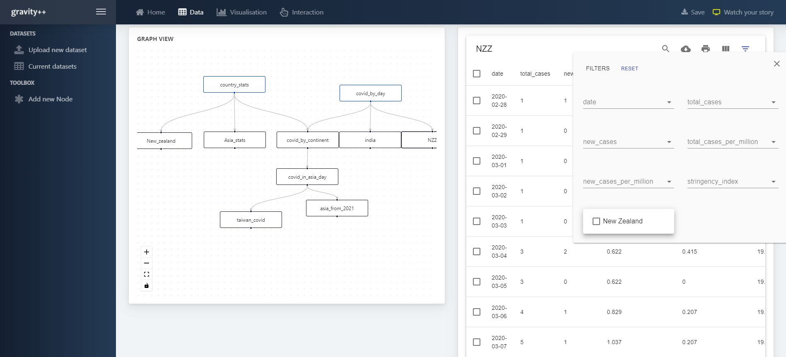

# GravityPlusPlus
A Graph-based Visualisation Software for Interactive Visualisation Design.

[Working demo](http://139.59.103.42:7472/#/home)

Build the docker container.

    docker-compose build
    
Build the client
    
    cd client
    
    npm install 
    
Run the Node server and Neo4J database.

    docker-compose up
    
To run the client, 
    
    cd client
    
    npm start

Access the client side from a browser:

    http://localhost:7472/

API Server

    http://localhost:7473/

Neo4J Browser access

    http://localhost:7474/

